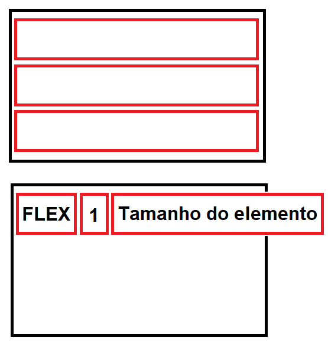

# FlexBlog
O *FlexBlog* foi um projeto desenvolvido ao longo do curso de [**CSS Flexbox da ORIGAMID**](https://www.origamid.com/curso/css-flexbox/).
Seu objetivo é por em prática as propriedades do display flex.

# DISPLAY FLEX
Quando usa-se em um elemento
```css
display: flex;
```
este vira um flex container e os itens existentes dentro dele viram itens flex.
Diferentemente de um display de bloco (block), os itens ficam um ao lado do outro tendo o item o tamanho do conteúdo e não do container.

<p align="center">
  
</p>

O comportamento padrão é estourar o container caso os elementos não caibam. A propriedade **flex-wrap: wrap;** faz o item quebrar, assim os elementos quebram em outras linhas. E utilizando a propriedade flex item **flex: 1;** os itens ocupam o tamanho máximo do container.
Lembrando que um item flex pode ser um container flex também, basta colocar:
```css
display: flex;
```

## Flex Container

### ```flex-direction```
```css
display: flex;
flex-direction: row; /* PADRÃO, itens em linha */
flex-direction: row-reverse; /* inverte a ordem */
flex-direction: column; /* itens em coluna */
flex-direction: column-reverse; /* coluna de ordem inversa*/
```

### ```flex-wrap```
```css
display: flex;
flex-wrap: nowrap; /* PADRÃO, sem quebra de linha */ 
flex-wrap: wrap; /* com quebra de linha */
flex-wrap: wrap-reverse; /* com quebra de linha invertendo a ordem dos itens */
```

### ```flex-flow```
É um atalho para as propriedades descritas anteriormente.
```css
display: flex;
flex-flow: row nowrap;
flex-flow: row wrap;
flex-flow: column nowrap;
/* row = linha; column = coluna; wrap = quebra; nowrap = sem quebra */
```

### ```justify-content```
Alinha os itens no eixo X e só funciona se os itens não ocuparem todo o container. 
```css
display: flex;
justify-content: flex-start; /* ao início do container */
justify-content: flex-end; /* ao final */
justify-content: center; /* ao centro */
justify-content: space-between; /* espaço no meio dos itens */
justify-content: space-around; /* envolta dos itens, sendo os entre os itens 2x maiores */
```

### ```align-items```
Alinha de acordo com o eixo do container.
```css
display: flex;
align-items: stretch; /* itens se estendem igualmente para preencher o container */
align-items: flex-start; /* ao topo */
align-items: flex-end; /* ao bottom */
align-items: center; /* ao centro */
align-items: baseline; /* de acordo com a linha de base da tipografia */
```

### ```align-content```
Alinha as linhas do container em relação ao eixo Y.
```css
display: flex;
align-content: stretch; /* PADRÃO */
align-content: flex-start;
align-content: flex-end;
align-content: center;
align-content: space-between;
align-content: space-around;
```

## Flex Item
Os Flex Itens são os filhos diretos do Flex Container.

### ```flex-grow```
Habilidade de um item crescer.
```css
flex-grow: 0; /* PADRÃO, obedece o width do elemento */
flex-grow: 1;
flex-grow: 2; /* tentará ocupar 2 vezes mais espaço extra do que os outros elementos */
```

### ```flex-basis```
Indica o tamanho inicial do flex item antes da distribuição do espaço restante.
flex-grow: 1; é igual a flex-basis: auto; o valor restante para ocupar o container é distribuído ao redor do conteúdo do flex-item.
```css
flex-basis: auto; /* PADRÃO, largura da base igual a do item */
flex-basis: unidade; /* %, em, px */
flex-basis: 0;
```

### ```flex-shrink```
Define a capacidade de redução de tamanho do item.
```css
flex-shrink: 1; /* PADRÃO, o item tem seu tamanho prõprio */
flex-shrink: 0; /* item não diminui */
flex-shrink: número; /* um item com shrink: 3 diminuirá 3 vezes mais que um item com 1. */ 
```
### ```flex```
Atalho para as propriedades flex-grow, flex-shrink e flex-basis. É recomandado o seu uso.
```css
flex: 1; /* flex-grow: 1; flex-shrink: 1; e flex-basis: 0; */
flex: 0 1 auto; /* PADRÃO */
flex: 2; /* flex-grow: 2; flex-shrink: 1; e flex-basis: 0; */
```

### ```order```
Modifica a ordem dos flex itens, do menor para o maior.
```css
order: número; /* número para modificar a ordem padrão, pode ser negativo */
order: 0; /* PADRÃO, ordem apresentada no HTML */
```

### ```align-self```
O align-self defini o alinhamento de um únicoitem dentro do container. Ele passa por cima do align-items do container.
```css
align-self: auto;
align-self: flex-start;
align-self: flex-end;
align-self: center;
align-self: baseline;
align-self: stretch;
```

## Referencias:
https://www.freecodecamp.org/news/learn-flexbox-build-5-layouts/
https://i.redd.it/3rzo2tatfns21.png